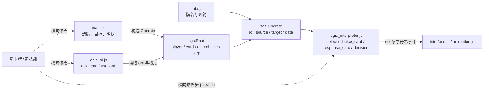
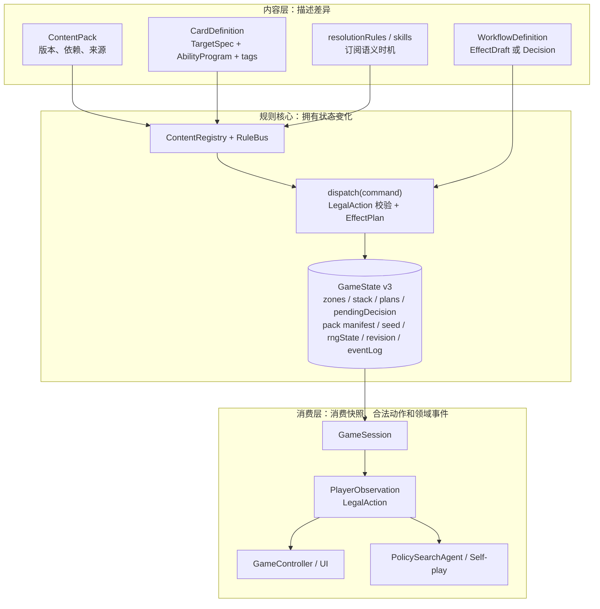

# 拆文件不等于解耦：十五年前的三国杀网页如何长成一个规则引擎

很久以前想要复刻三国杀网页版，不过当时并没有完成。翻开十五年前的代码发现很多幼稚的地方，没有引入 jQuery，很多当年 ECMA 标准的语法，满屏的 `var`。卡牌游戏的核心是当一张牌被打出以后，游戏引擎必须知道接下来会发生什么。

界面要知道它能选几个目标；卡牌解释器要知道是否询问“闪”或“无懈可击”；AI 要知道当前 `opt` 是主动出牌、被动响应还是濒死求桃；动画要猜一条 `"apply_card"` 消息究竟代表使用、命中还是弃置。添加一张牌，往往不是增加一个定义，而是在目标选择、结算、AI、动画和若干映射表里分别加一个 `case`。

这套代码并非一开始就这么复杂。它经历了一个很常见的过程：先把游戏做出来，然后把越来越长的文件拆开，以为这就是解耦；等扩展包、装备、武将技、延时锦囊和无懈链真的进来，才发现文件虽然分开了，规则上下文仍粘在一起。

这篇尝试探索一个设计边界，在一款卡牌游戏应该把哪些东西做成数据，哪些东西留在引擎里，卡牌、技能、UI 和 AI 又该通过什么边界合作？

## 一个能跑起来的 naive 版本

仓库最早的提交是 2011 年 5 月 14 日。到 2011 年 7 月的旧版本，核心对象仍然很小：

```javascript
sgs.Card = function(name, color, digit) {
    this.name = name;
    this.color = color;
    this.digit = digit;
    this.enable = true;
};

sgs.Operate = function(id, source, target, data) {
    this.id = id;
    this.source = source;
    this.target = target || undefined;
    this.data = data || undefined;
};
```

`Card` 只保存牌名、花色、点数和一个 `enable` 开关。真正的规则不在牌上，而在 [`logic_interpreter.js`](logic_interpreter.js) 里根据牌名解释。`Operate` 则是一个万能方法：主动出牌、响应、技能、判定和弃牌都塞进 `id / source / target / data` 四个字段。

这对原型很合适。最初只需解决几个问题：

- 当前轮到谁；
- 玩家手里有哪些牌；
- “杀”能选谁；
- 对方有没有“闪”；
- 扣血以后是否结束。

于是 `sgs.Bout` 同时保存玩家、牌堆、阶段、操作栈和响应队列：

```javascript
this.player = player;
this.card = ccard;
this.opt = [];
this.choice = [];
this.step = 0;
```

整个流程可以概括为：

```text
界面构造 Operate
  -> Bout 把 Operate 放进 opt 或 choice
  -> interpreter 按 card.name 分支
  -> 直接修改 Player、Bout 和数组
  -> notify 一个字符串事件给界面
```

这个模型的优点非常直接：对象少，调用链短，调试时看几组数组就能知道游戏大概走到哪里。只做“杀、闪、桃”，甚至加入少量锦囊时，它完全可以工作。

问题出在三国杀不是一组互不相干的卡牌效果，而是一张不断增厚的规则网。

## 当卡牌开始拥有上下文

以“杀”为例。它的本征效果似乎只是对目标造成一点伤害，但完整语义还包括：

- 目标是否合法，距离和攻击范围是多少；
- 本回合是否已经使用过“杀”；
- 目标能否响应“闪”；
- 仁王盾、藤甲、八卦阵等装备是否介入；
- 武圣、龙胆、倾国等技能能否生成虚拟牌；
- 铁骑、烈弓、无双等技能是否改变响应窗口；
- 属性“杀”是否传播铁索伤害；
- 伤害后是否进入濒死、求桃和死亡流程；
- UI 应该灰掉哪些牌、高亮哪些目标、播放哪些动画；
- AI 能看到哪些信息，又能选择哪些动作。

如果把这些内容都写进“杀”，那么“杀”会依赖所有装备和技能；如果把它们都写进装备与技能，那么引擎又必须提供足够稳定的时机和语义事件。旧实现选择了第三条路：大家一起读取 `Bout` 和 `Operate` 的当前形状。

这就是上下文耦合。某个函数的参数看起来只有 `opt`，实际前置条件却可能是：

```text
bout.opt[0] 必须存在
choice 的末尾必须是当前请求
opt.target 的含义必须与 opt.id 匹配
某张牌必须已经被压入栈，但尚未从手牌移除
```

早期 AI 中有一段很典型的代码：

```javascript
var opt_top = this.bout.opt[0];

case "无懈可击":
    if(opt.source == pl && opt_top.target != pl) {
        // ...
    }
```

当无懈请求出现，而 `bout.opt[0]` 没有按约定准备好时，错误不是“无懈流程状态非法”，而是：

```text
Cannot read properties of undefined (reading 'target')
```

这不是单纯漏了一个空值判断。补上 `opt_top &&` 可以避免崩溃，却无法回答更根本的问题：AI 为什么需要窥视解释器内部栈顶，才能判断自己是否拥有一个合法响应？

## 第一次“解耦”：把代码拆开

2011 年 5 月 19 日，仓库新增了 `logic_interpreter.js`，提交说明是“添加解析脚本对象”。随后又有 `logic_ai.js`、`interface.js` 和 `animation.js`。从文件名看，职责已经相当清楚：

- `logic.js`：玩家、卡牌、对局和基础操作；
- `logic_interpreter.js`：选择目标与结算；
- `logic_ai.js`：电脑决策；
- `main.js`：DOM 交互；
- `interface.js`、`animation.js`：展示与动画；
- `data.js`：卡牌、武将和各种映射。

到 2011 年 7 月，这七个文件加起来接近 2900 行。代码不再挤在一个文件里，但依赖方向没有变化。解释器直接改 `Player` 和 `Bout`；AI 直接读解释器的 `opt`；界面直接构造 `Operate`；动画依赖解释器发出的字符串；新增卡牌仍需要同步修改多处 `switch(card.name)`。

换句话说，这只是**物理拆分**，不是**规则解耦**。



判断一段代码有没有解耦，不能数文件或 class，而要问三个问题：

1. 添加一种新内容时，需要修改多少个既有模块？
2. 一个模块能否只依赖显式输入，还是必须猜测全局对象正处于什么阶段？
3. 同一条规则在 UI、AI 和引擎中是否各自实现了一遍？

旧版本对这三个问题的回答都不理想。

## 重构

新实现没有把目标定成“使用 TypeScript”或“多建几个目录”。真正的目标只有一句话：

> 卡牌描述自己的意图，规则系统补充上下文，只有引擎能够修改游戏状态。

这句话改变了依赖方向。



它不是为了让图更漂亮，而是为了让一个扩展包能够增加卡牌和规则，不必回头编辑标准牌、AI 和 DOM 代码。

## 牌只描述本征效果

现在的 [`CardDefinition`](src/core/registry.ts) 明确分开了几件事：

```typescript
interface CardDefinition {
  id: CardDefinitionId;
  category: "basic" | "trick" | "equipment";
  tags?: string[];
  target: TargetSpec;
  program: AbilityProgram;
  abilities?: AbilityRule[];
  delayed?: {
    judgment: JudgmentPattern;
    onMatch: AbilityProgram;
    onMiss: "discard" | "pass-to-next";
  };
}
```

“杀”的定义包含：

- 稳定 ID；
- `response:slash` 和伤害属性标签；
- 每回合使用次数；
- 目标是攻击范围内的一名其他存活角色；
- 对每个目标造成伤害的本征程序。

它不调用 `askJink()`，也不查八卦阵、仁王盾或某位武将的技能。要求“闪”的规则属于标准包的 `resolutionRules`：

```typescript
{
  id: "standard:resolution:slash-defense",
  match: { tags: ["response:slash"] },
  scope: "each-target",
  operation: {
    type: "require-response",
    acceptedTags: ["response:jink"],
    responseKind: "jink",
    acceptedOutcome: { type: "cancel", reason: "jink" }
  }
}
```

同样，锦囊能否被“无懈可击”抵消，也不是每张锦囊各写一遍：

```typescript
{
  id: "standard:resolution:trick-nullification",
  match: { category: "trick" },
  scope: "target-or-card",
  operation: { type: "allow-nullification" }
}
```

这带来一个重要性质：如果另一个内容包注册一张带有 `response:slash` 标签的新“杀”，它会自然进入同一条闪响应管线；如果某个独立规则集没有注册锦囊无懈规则，锦囊也不会凭空拥有无懈窗口。上下文属于规则集，而不是硬编码在卡牌身体里。

标签并不是万能字符串。它们只负责建立稳定的语义连接，最终仍由有类型的 `CardResolutionRule`、`EffectDraft` 和 `DomainEvent` 约束可以发生什么。

## RuleBus 解决的是参与问题，不是通信问题

很多项目一看到耦合就加 EventBus，最后只是把直接调用换成难以追踪的字符串广播。这里的 [`RuleBus`](src/core/rule-bus.ts) 有意限制了入口，目前只有六个语义点：

- `card-declared`；
- `target-confirmed`；
- `delayed-card-resolving`；
- `before-effect`；
- `after-event`；
- `legal-actions`。

发布者提交有类型的输入，RuleBus 从已安装内容包和当前棋盘发现参与规则，再返回组合后的效果或合法动作。它不是“发出去就不管”的消息总线，更接近一个确定性的规则组合器。

例如“杀”的伤害先编译成目标效果。`target-confirmed` 处的标准规则把它包进一个 `request-response`：

```text
目标打出合法的闪
  -> 执行 cancel(jink)

目标放弃
  -> 继续执行原伤害
```

装备与技能可以在 `before-effect` 或 `after-event` 介入，但卡牌不知道参与者是谁。真正的解耦不是让调用消失，而是让调用指向稳定的语义接口。

## 决策必须成为状态，而不是回调

卡牌游戏最难保存的不是玩家血量，而是“刚才运行到哪里”。

旧版用 `opt`、`choice`、定时器和回调共同表达暂停状态。只要在响应过程中刷新页面，或者 AI 与动画的回调顺序变化，就很难恢复现场。新 Core 把未完成的结算显式放进状态：

```typescript
interface GameState {
  stack: ResolutionFrame[];
  triggerQueue: ResolutionFrame[];
  effectPlans: Record<EffectPlanId, EffectPlan>;
  pendingDecision: PendingDecision | null;
}
```

内容产生嵌套的 `EffectDraft`。引擎把“接受以后做什么”“所有人放弃以后做什么”“判定命中或失败以后做什么”物化成扁平的 `EffectPlan`，状态里只保存 plan ID。`assertGameState()` 甚至会拒绝嵌在快照里的运行时 continuation。

因此一次响应窗口可以被描述为：

```text
Request:
  playerId = p2
  type = respond-card
  acceptedDefinitionIds = [所有带 response:jink 的定义]
  passAllowed = true

Continuation:
  acceptedPlanId = 取消本次杀
  passedPlanId = 造成伤害并继续濒死检查
```

`GameState` 还保存 `schemaVersion`、`seed`、`rngState`、`revision` 和 `nextSequence`。这让保存、恢复、复盘和确定性测试拥有同一个基础，而不是以后再从动画日志里反推。

## Command、Effect、Event 各自回答一个问题

卡牌引擎常见的另一个陷阱，是把“玩家想做什么”“规则将做什么”和“已经发生了什么”混成一个对象。现在三者分开：

| 概念 | 回答的问题 | 例子 |
| --- | --- | --- |
| `GameCommand` | 玩家或 AI 想做什么 | `use-card`、`respond-card`、`choose-cards` |
| `Effect` / `EffectPlan` | 引擎接下来要如何改变状态 | `damage`、`move-card`、`request-response` |
| `DomainEvent` | 状态已经发生了什么变化 | `CardMoved`、`DamageApplied`、`DecisionRequested` |

`dispatch()` 先验证命令是否存在于当前 `LegalAction[]`，再克隆状态、增加 revision、物化效果计划并依次结算。事件在状态变化后产生，供技能触发、UI 动画、日志和未来的录像系统消费。

这种区分避免了一个很微妙的错误：动画完成不应该决定伤害是否生效。伤害先在 Core 中发生，`DamageApplied` 只是通知 UI 如何表现；动画失败也不能让规则状态停在半路。

## 五谷丰登为什么需要 workflow

不是所有卡牌都能写成一串静态原子效果。“五谷丰登”至少包含：

1. 按存活人数从牌堆顶展示牌；
2. 从当前座次开始，逐名角色结算；
3. 对每名角色开启独立的无懈窗口；
4. 未被抵消的角色从剩余牌中选一张；
5. 把余牌放入弃牌堆。

这是一段会多次暂停和恢复的协议。当前实现把它放在内容包自己的 [`WorkflowDefinition`](src/content/standard/workflows.ts) 中，状态依次经过 `prepare -> after-take -> step -> choose`。每次运行只能：

- 读取不可变游戏快照；
- 返回通用 `EffectDraft[]`；
- 请求一个 `WorkflowDecision`；
- 保存可序列化的 `resumeData`。

workflow 不能直接修改引擎。

这是一个有意保留的逃生舱。把所有规则强行塞进声明式 DSL，最终会造出另一门难以调试的编程语言；让任意卡牌函数直接操作 `GameState`，又会回到十五年前。更务实的边界是：常见机制使用 `AbilityProgram` 和规则组合，复杂协议可以写 TypeScript，但只能通过不可变输入和通用效果与引擎交流。

因此，“数据驱动”不是追求百分之百 JSON，而是控制特例代码能拿到的权限。

## UI 和 AI 必须共享同一份合法动作

旧版有两套合法性：

- UI 先允许玩家点牌，再调用 `select_card()` 判断能否选择目标；
- AI 自己按牌名、权重和 `bout.select_card()` 推导可用动作。

两套逻辑稍有漂移，就会出现两类典型问题：

- 玩家选中牌以后才发现不能用，确认按钮也无法继续；
- AI 构造了 UI 从未考虑过的上下文，解释器在 `opt.target` 上崩溃。

现在 [`getLegalActions()`](src/core/engine.ts) 是唯一动作来源。它枚举当前玩家的手牌、目标组合、响应、选择和阶段命令，再让技能规则修正动作集合。

[`GameController`](src/ui/game-controller.ts) 不重新判断卡牌规则。它把 legal actions 按手牌归组：

```typescript
{
  cardId,
  enabled: uses.length > 0 || response !== undefined,
  targetSets: uses.map(action => action.targetIds)
}
```

这直接对应两个界面行为：

- 没有任何合法动作的牌在选中之前就灰掉；
- 选中一张牌后，所有合法 `targetSets` 中出现的英雄统一高亮。

AI 也只读取 [`PlayerObservation`](src/ai/observation.ts)：自己的手牌、公开区域、其他玩家的手牌数量、当前决策，以及同一份 `legalActions`。[`PolicySearchAgent`](src/ai/policy-agent.ts) 只负责给合法动作评分，不再负责发明动作。

未来无论接启发式搜索、MCTS 还是模型策略，动作空间都不需要重新实现卡牌规则。AI 的能力可以变，规则真相只有一份。

## ContentPack 是扩展边界，不只是卡牌数组

如果目标是继续加入后续版本，扩展包必须回答的不只是“多了哪些牌”。当前 [`ContentPack`](src/core/registry.ts) 包含：

- `id` 与 `version`；
- `requires` 依赖；
- 卡牌定义与实体牌印刷清单；
- 武将、技能和 workflow；
- 卡牌结算规则；
- 发行时间、证据 URL 和固定规则源码修订。

目前仓库注册了标准版、军争篇、风、火、林。标准版有 25 名武将、40 个技能和 32 种牌；军争篇新增 11 种牌。两者合计 43 种稳定卡牌定义，并用 108 张标准牌与 52 张军争牌的实体花色、点数清单生成牌堆。

当前已安装范围内的风 11、火 13、林 18 个扩展技能已经全部迁入 Core，并由注册检查保证为 `complete` 且至少声明一种可执行能力。风火林各两名隐藏神将仍未接入，但它们从未进入当前 ContentPack，属于后续新增内容，而不是从旧生产规则迁移遗漏。

版本化还有一个容易被忽略的价值：以后某张牌在新版规则中发生变化时，不应该悄悄改掉所有旧录像。规则集、内容包版本、随机种子和状态 schema 一起，才有可能重现某一局。

## 当前实现和十五年前到底差在哪

| 维度 | 2011 naive 实现 | 第一次“解耦” | 当前 Core |
| --- | --- | --- | --- |
| 卡牌身份 | 中文牌名驱动分支 | 仍以牌名跨文件匹配 | 稳定 definition ID、标签与版本化 pack |
| 状态 | `Bout` 与 `Player` 可变对象 | 多文件共享同一对象 | 可序列化 `GameState v3`，含 pack 来源与素材 manifest |
| 流程暂停 | `opt`、`choice`、回调和定时器 | 队列被更多模块读取 | `PendingDecision + EffectPlan ID` |
| 上下文规则 | 卡牌分支主动询问 | 抽出函数但仍手动调用 | RuleBus 按语义时机组合 |
| UI 合法性 | 点击后临时判断 | UI 调解释器查询 | UI 投影 `LegalAction[]` |
| AI | 按牌名自己构造动作 | 直接窥视 `bout.opt[0]` | 对 `PlayerObservation.legalActions` 评分 |
| 动画 | 字符串通知夹带语义 | 与解释器事件约定绑定 | 投影 `DomainEvent` |
| 扩展 | 修改全局数组与 switch | 在更多文件里加 case | 注册 ContentPack、规则、program 或 workflow |
| 随机与回放 | `Math.random()` 式全局过程 | 无稳定恢复边界 | seed、rngState、revision、eventLog |

最大的差异不是代码量。当前 `src` 下的核心、内容、AI、Session、UI 和浏览器桥接已经超过一万行，显然比旧实现更大。区别在于复杂度被放在哪里：旧版把复杂度藏在调用顺序和共享对象里，新版把它放进类型、状态机、规则点和可检查的数据结构中。

后者看起来更啰嗦，却能回答“现在为什么可以响应”“放弃以后恢复哪段流程”“这张牌为什么灰掉”。

## 测试不是补丁，而是架构的压力计

当前自动化包含 16 个 Core 测试文件、134 个 Core 场景和 24 个浏览器流程。旧逻辑矩阵还会跑 43 张牌 × 49 名武将 × 4 种身份，共 8428 组组合；回合矩阵覆盖 49 × 4，共 196 组阶段循环。

这些数字不证明游戏已经完整。它们证明另一件事：规则已经有足够稳定的入口，可以批量构造状态、枚举合法动作、提交命令并检查领域事件。

对扩展架构尤其重要的测试不是“这张牌能造成一点伤害”，而是机制测试：

- 新的 `response:slash` 牌是否自动获得闪响应；
- 新锦囊是否自动进入无懈链；
- 不注册无懈规则的独立 pack 是否保持无懈关闭；
- 目标被技能改写后，UI 与 AI 是否拿到同一动作集合；
- 在任意 `PendingDecision` 上保存再恢复，后续事件是否一致；
- 同一 seed 与命令序列是否产生同一事件日志；
- 当前安装包是否仍出现 `partial` 技能，或完整技能缺少可执行能力。

测试应该压依赖边界，而不只是覆盖 if 分支。

## 一款架构良好的卡牌游戏，先设计这八件事

如果今天从零开始做一款可扩展卡牌游戏，我不会先写“杀”的 class，而会先固定八个边界。

### 1. 稳定 ID 与区域模型

每张实体牌有 instance ID，每种规则定义有 definition ID。手牌、装备区、判定区、处理区、牌堆和弃牌堆都是显式 zone。任何时刻，一张实体牌只能位于一个区域。

这是移动动画、隐藏信息、装备替换、判定、偷牌、回放和一致性校验共同依赖的基础。

### 2. 可序列化、可校验的唯一状态

状态中不能藏 DOM、函数、Promise 或 class 实例引用。需要暂停的流程必须转化为数据。每次命令后都能执行 invariant：

- 所有 card ID 都有定义；
- 每张牌恰好位于一个 zone；
- 所有 plan ID 都存在；
- pending decision 的玩家仍然存活且有权行动；
- revision 和 event sequence 单调递增。

### 3. Command、Effect、Event 三段式

Command 是意图，Effect 是规则计划，Event 是事实。外部只能提交 Command；只有引擎执行 Effect；UI、AI 训练、日志和技能触发消费 Event。

这个边界一旦模糊，联网同步、录像和动画迟早会互相污染。

### 4. 显式时机与确定顺序

卡牌游戏的复杂度主要来自“谁能在什么时候介入”。时机必须是有限集合，并定义优先级、座次顺序、可选与强制、一次与重复、取消与替换的关系。

不要让卡牌 A 直接调用技能 B。让 A 发布“目标已确认”或“伤害前”语义，B 声明自己是否匹配。

### 5. 决策是可恢复状态

选目标、选牌、是否发动、响应卡牌、重新排序，都应该统一成 `DecisionRequest`。每个请求带 decision ID、候选集合、数量约束和 continuation。

只要一个流程可能等人，它就不能只存在于 JavaScript 调用栈里。

### 6. 唯一合法动作生成器

UI、AI、网络客户端和测试都消费同一 `LegalAction[]`。它既是防作弊边界，也是交互提示和 AI action space。

“按钮能不能点”不应由 CSS 或另一个简化版规则决定。

### 7. 版本化内容注册

卡牌、技能、武将、实体牌清单、模式规则和素材都属于 pack。Pack 有版本、依赖和来源。注册时检查重复 ID、缺失依赖、未知技能和未知实体牌定义。

扩展的验收标准应该是“安装这个 pack 不修改引擎 switch”，而不是“成功建了一个新目录”。

### 8. 受控的特例出口

声明式 program 适合高频、可组合机制；复杂多阶段协议可以使用代码，但只能读取快照、请求决策、返回原子效果。逃生舱必须存在，也必须比直接改状态更窄。

好的架构不是消灭特例，而是让特例无法越权。

## 迁移后的浏览器边界与后续演进

这次重构已经让生产入口不再加载 `logic.js`、`logic_ai.js` 和 `logic_interpreter.js`，但浏览器还不是纯新架构。

[`index.html`](index.html) 仍加载 `data.js`、`logic_func.js`、`main.js`、`interface.js` 和 `animation.js`。[`CoreBoutAdapter`](src/browser/core-bout-adapter.ts) 维护 UI ViewModel 与 Core ID 的双向映射，再把 `DomainEvent` 投影到现有 jQuery 页面。身份配置、主公候选、选将池和最终座次已经由 Core `MatchSetup` 产生，`main.js` 只负责展示选择并提交结果。

这层桥接是迁移手段，不应被画成最终架构。真正清理完成的标准是：

```text
MatchSetup 直接创建规则集和玩家
  -> GameSession 持有唯一状态
  -> GameController 消费 PlayerObservation
  -> 当前 View 只渲染 ViewModel 和 DomainEvent
```

规则与交互协议已经完成迁移；adapter 和展示数据副本只剩 UI 适配职责。以后替换 jQuery View 时可以一起删除，但不再影响规则唯一性。

规则侧也还有边界要继续打磨：

- 部分多阶段规则依赖 TypeScript workflow；
- `AbilityProgram` 每增加一种基础机制，仍需要扩展编译器和原子 Effect；
- AI 只是确定性的启发式评分，还没有身份推断、多步搜索和对手模型；
- 当前多张牌共享通用动画，并非 43 种牌都有专属演出。

承认这些缺口很重要。架构存在的意义不是让未完成内容看起来已经完成，而是让缺口能够被精确定位。

## 最后用一个问题判断是否真的解耦

以后再添加一张新卡或一个武将技，可以做一个很简单的审查：

> 为了实现它，是否必须修改一张无关的旧卡、AI 的牌名分支、UI 的合法性判断，或者引擎中的内容名称 switch？

如果答案是“是”，先别急着加 case，应该看看缺的是不是一个通用语义、时机、Effect 或 Decision。

当然，也不是任何一次引擎修改都说明架构失败。新扩展真的可能带来前所未有的机制，这时应该有意识地扩展引擎词汇，并用两个以上内容验证它是机制而不是某张卡的暗号。关键是依赖方向：内容可以依赖稳定的引擎能力，引擎不应该认识“黄忠”“五谷丰登”或某个扩展包的中文牌名。

十五年前的代码已经知道要把逻辑、AI、界面和动画拆开。它缺的不是模块意识，而是对规则上下文的建模。真正的解耦也不是继续拆文件，而是把隐藏在调用顺序里的协议，变成显式状态、合法动作、语义时机和可组合效果。

当一张卡牌终于不必知道谁可能响应它、不必知道 UI 如何高亮、不必知道 AI 如何选择，也不必知道动画何时结束，它才真正只是一张卡牌。
